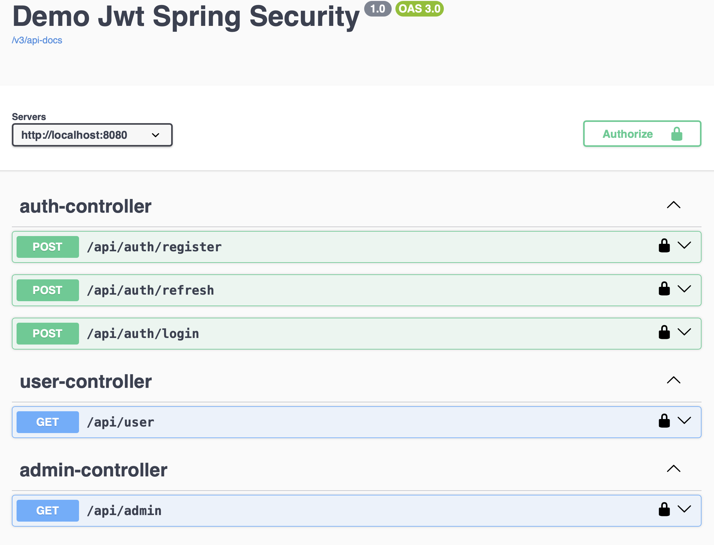

# К чему стремиться

В окончании этого квеста ожидаем получить следующий функционал:



- Запрос на `http://localhost:PORT/api/auth/register` с моделью

```json
{
  "fullName": "string",
  "email": "string",
  "password": "string"
}
```

позволит зарегистрировать пользователя с правами USER

Develop-вид ответ

```
{
  "id": 16,
  "fullName": "string",
  "email": "string1",
  "password": "$2a$10$8pnqWS.bY6c1vTU0wiPhcumk1bNCFHzaqmqvjM40KDIq/Mgb7YeUG",
  "role": "USER",
  "enabled": true,
  "credentialsNonExpired": true,
  "authorities": [
    {
      "authority": "USER"
    }
  ],
  "username": "string",
  "accountNonExpired": true,
  "accountNonLocked": true
}
```

- Запрос на `http://localhost:PORT/api/auth/login` с моделью

```json
{
  "email": "string",
  "password": "string"
}
```

позволяет получить jwt-токен пользователя

В ответ приходит модель

```json
{
  "email": "string",
  "jwtToken":     "ey...IUzNiJ9.eyJ...NTl9.cJ...lk5d",
  "refreshToken": "ey...zI1NiJ9.eyJ...WF0I.mW...hLIJ"
}
```

- Запрос на `http://localhost:PORT/api/user` с токеном роли USER даст ответ `ok`
- Запрос на `http://localhost:PORT/api/user` с токеном роли ADMIN даст ответ `Error: response status is 401`

- Запрос на `http://localhost:PORT/api/admin` с токеном роли ADMIN даст ответ `ok`
- Запрос на `http://localhost:PORT/api/admin` с токеном роли USER даст ответ `Error: response status is 401`

[Шаг 3](./step-03.md)
