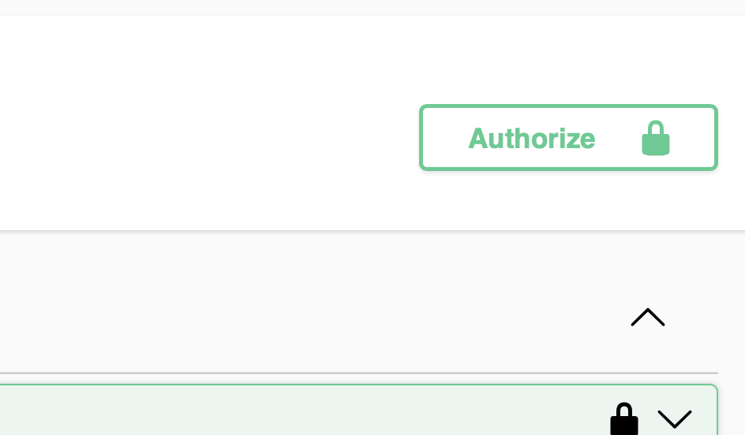

# Донастройка Swagger

```xml
<dependency>  
    <groupId>org.springdoc</groupId>  
    <artifactId>springdoc-openapi-starter-webmvc-ui</artifactId>  
    <version>2.6.0</version>  
</dependency>
```

В пакете `configuration` класс `SwaggerConfig`

```java
@Configuration
@SecurityScheme(name = "Bearer Authentication", type = SecuritySchemeType.HTTP, bearerFormat = "JWT", scheme = "bearer")
public class SwaggerConfig {

    @Bean
    public OpenAPI api() {
        return new OpenAPI()
                .servers(List.of(new Server().url("http://localhost:8080")))
                .info(new Info().title("Demo Jwt Spring Security").version("1.0"))
                .addSecurityItem(new SecurityRequirement().addList("Bearer Authentication"))
                .components(new Components()
                        .addSecuritySchemes("Bearer Authentication",
                                new io.swagger.v3.oas.models.security.SecurityScheme()
                                        .type(io.swagger.v3.oas.models.security.SecurityScheme.Type.HTTP)
                                        .scheme("bearer")
                                        .bearerFormat("JWT")));
    }
}
```

Результат: появление кнопки



[\<\< Назад](./step-09.md)
